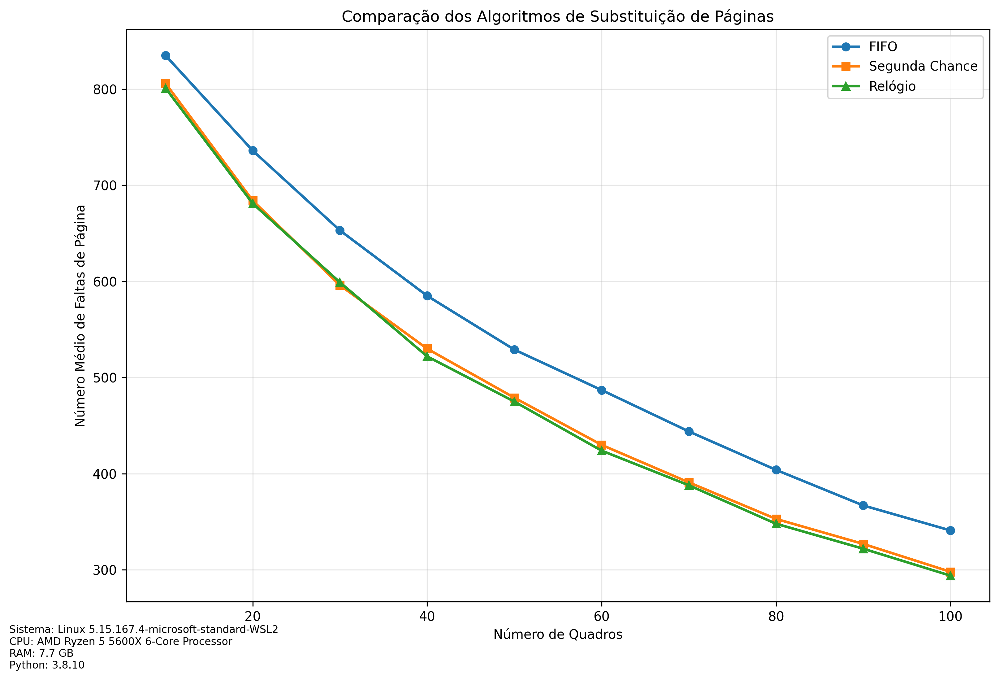

# Comparação de Algoritmos de Substituição de Páginas

## Metodologia

Para a realização deste experimento, foi implementada uma simulação de gerenciamento de memória virtual, comparando o desempenho de três algoritmos de substituição de páginas: FIFO (First-In-First-Out), Segunda Chance e Relógio.

As principais características da simulação são:

1. **Espaço de Endereçamento**: O espaço de endereçamento dos processos é de 200 páginas, com as referências variando de 1 a 200.
2. **Distribuição de Referências**: Inicialmente, as referências de páginas eram geradas de forma aleatória, seguindo uma distribuição uniforme. Posteriormente, foi implementada uma distribuição de Zipf com parâmetro de forma 0.8 para simular um padrão de acesso a páginas mais realista.
3. **Número de Quadros**: O número de quadros de memória disponíveis variou de 10 a 100, com incrementos de 10.
4. **Número de Experimentos**: Foram realizados 30 experimentos para cada algoritmo e tamanho de quadros, com 1000 referências de páginas em cada experimento.

## Resultados do Experimento

O gráfico a seguir apresenta os resultados da comparação entre os três algoritmos de substituição de páginas:

Sistema: 
- Linux 5.15.167.4-microsoft-standard-WSL2
- CPU: AMD Ryzen 5 5600X 6-Core Processor 
- RAM: 7.7 GB

## Análise dos Resultados

### Número de Faltas de Página:
   - O algoritmo FIFO apresenta o maior número de faltas de página em comparação com os outros algoritmos, principalmente quando o número de quadros é menor.
   - O algoritmo de Segunda Chance apresenta um desempenho melhor que o FIFO, com um número de faltas de página mais baixo em todos os cenários testados.
   - O algoritmo de Relógio apresenta o melhor desempenho, com o menor número de faltas de página entre os três algoritmos testados.

### Variação com o Número de Quadros:
   - À medida que o número de quadros aumenta, o número de faltas de página diminui para todos os algoritmos.
   - A redução é mais acentuada nos primeiros incrementos do número de quadros, indicando que há um ponto de saturação em que adicionar mais quadros não traz benefícios significativos.
   - O algoritmo de Relógio apresenta a curva de faltas de página mais suave, indicando que ele é menos sensível às variações no número de quadros disponíveis.

### Análise Geral:
   - O algoritmo de Relógio se mostra como o mais eficiente entre os três testados, apresentando o menor número de faltas de página em todos os cenários.
   - Esse resultado corrobora a teoria de que o algoritmo de Relógio, uma variante do algoritmo de Segunda Chance, consegue aproveitar melhor a localidade temporal das referências a páginas, resultando em um melhor desempenho.
   - É importante ressaltar que esses resultados são específicos para a simulação realizada, com as características definidas no enunciado do trabalho. Em cenários reais, os resultados podem variar de acordo com o padrão de acesso à memória dos processos.

## Conclusão

A simulação realizada permitiu a comparação do desempenho de três algoritmos de substituição de páginas amplamente utilizados em sistemas operacionais. Os resultados indicam que o algoritmo de Relógio apresenta o melhor desempenho, com o menor número de faltas de página, seguido pelo algoritmo de Segunda Chance e, por fim, o algoritmo FIFO.

Além disso, a implementação da distribuição de Zipf para as referências de páginas permitiu simular um padrão de acesso mais realista, evidenciando ainda mais as diferenças de desempenho entre os algoritmos.

Este estudo fornece insights importantes para a escolha do algoritmo de substituição de páginas mais adequado em um sistema operacional, considerando o equilíbrio entre desempenho e complexidade de implementação.